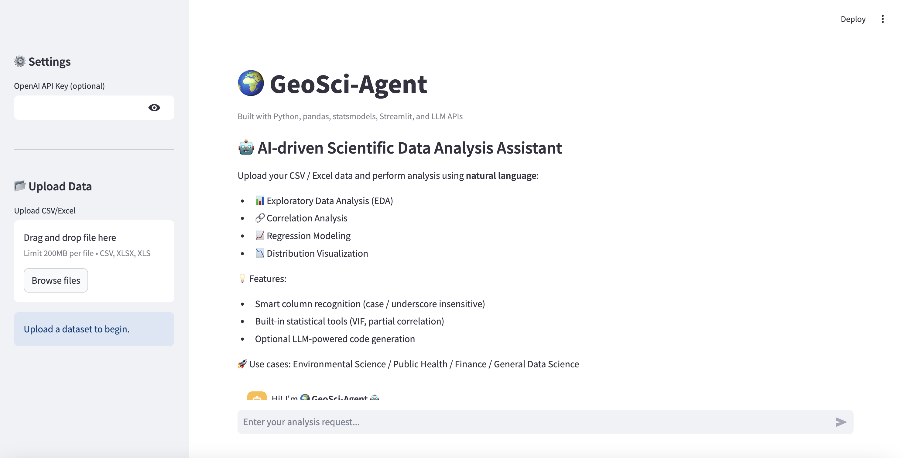
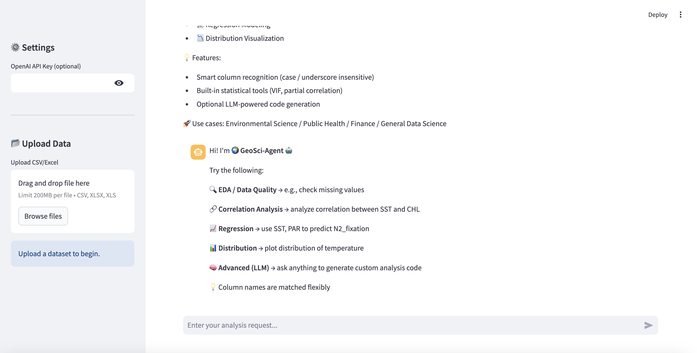
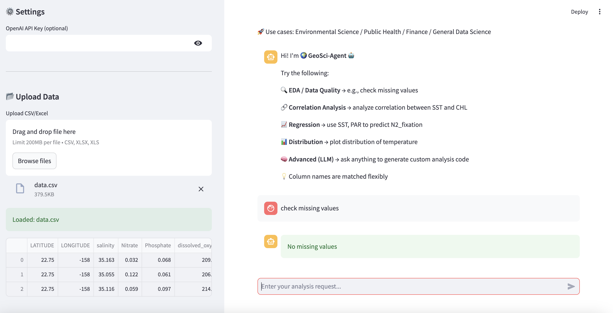
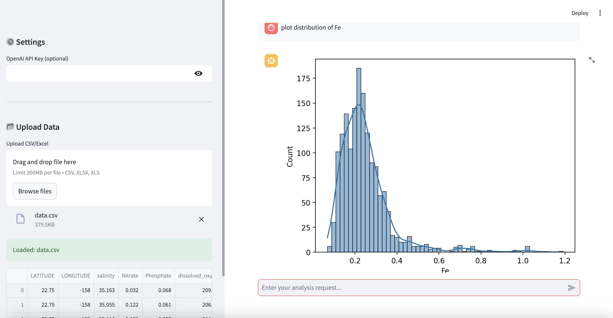
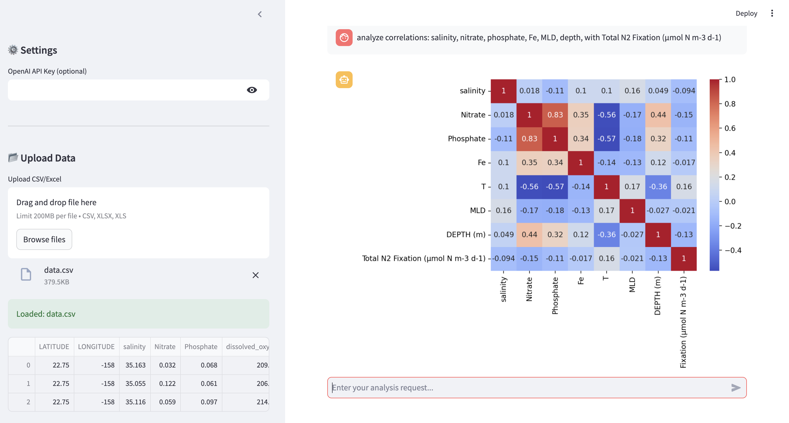
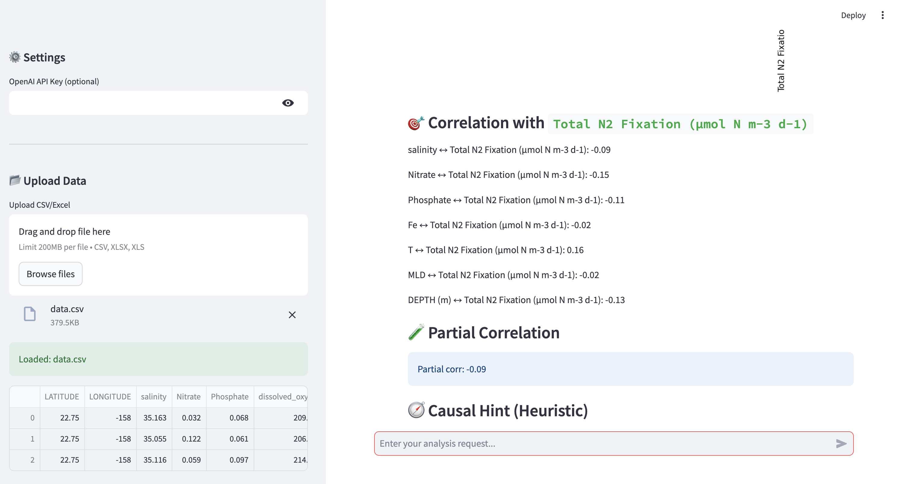

# 🌍 GeoSci-Agent

AI-assisted scientific data analysis tool built with **Python**, **Streamlit**, and optional **LLM integration**.

---

## 🚀 Overview

GeoSci-Agent allows you to explore datasets and perform statistical analysis using **natural language instructions**.  
It supports:

- Exploratory Data Analysis (EDA)
- Correlation Analysis (including partial correlation)
- Regression Modeling (OLS)
- Distribution Visualization
- Optional LLM-powered code generation (via OpenAI API)

This project was developed for rapid prototyping of an AI-assisted data analysis workflow.

---

## 🛠 Features

- Smart column recognition (case / underscore insensitive)
- Built-in statistical tools (VIF, partial correlation)
- Interactive visualizations with `seaborn` & `matplotlib`
- Human-in-the-loop workflow via natural language instructions
- Optional OpenAI API integration for custom analysis

---

## 💻 Quick Start

1. Clone the repository:

```bash
git clone https://github.com/pandasun-43/GeoSci-Agent.git
cd GeoSci-Agent
```

2. Install dependencies:
```bash
pip install -r requirements.txt
```

3. Run the app:
```bash
streamlit run app.py
```
Optional: Provide your OpenAI API key to enable LLM features.

## Demo Screenshots
### 1️⃣ App Interface
- **Fig 1 & 2:** Main interface and sidebar settings



### 2️⃣ Data Quality Check
- **Fig 3:** Check missing values (builtin_missing)


### 3️⃣ Distribution Visualization
- **Fig 4:** Distribution plot of a numeric variable (builtin_distribution)


### 4️⃣ Correlation Analysis
- **Fig 5:** Correlation heatmap of environment variables and target `y`


### 5️⃣ Variable–Target Relationships
- **Fig 6:** Each variable correlation with `y`, partial correlation, and heuristic causal hints


### Notes
- The app works offline for built-in analysis (EDA, correlation, regression)

- LLM features require a valid OpenAI API Key

- Designed for environmental / geospatial datasets but can work with any numeric data
